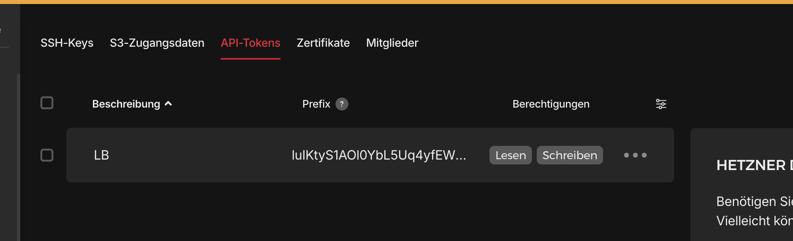
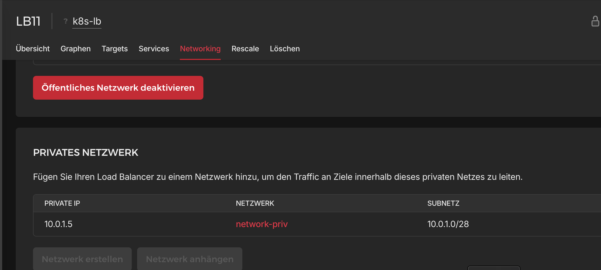
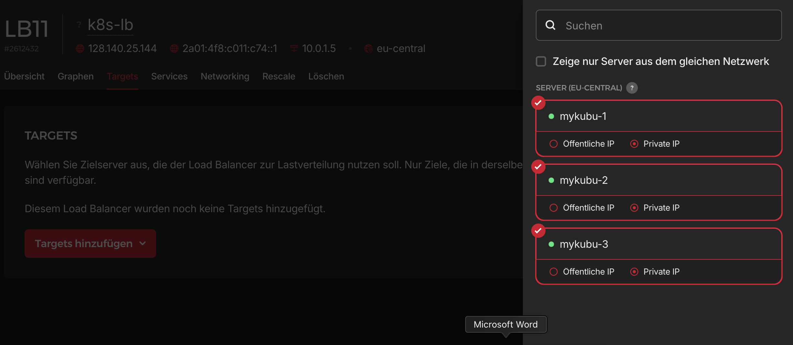

# Hetzner Cloud Kubernetes Cluster with Kubeadm, Harbor, Longhorn, NGINX Ingress, and CCM

This guide describes how to set up a **production-ready Kubernetes cluster** on **Hetzner Cloud** using `kubeadm`, with the following components:

- 3 Hetzner Cloud nodes (1 control plane + 2 workers)
- Hetzner Cloud Controller Manager (CCM)
- Longhorn for persistent storage
- NGINX Ingress Controller
- Harbor as a private container registry
- Cert-Manager with Let's Encrypt support

---

## Prerequisites

- A Hetzner Cloud account
- 3 Ubuntu 22.04 servers deployed via Hetzner
- Connect all Servers to the same private Network (optional but recommended)
- Expose them with IPv4 Adresses

---

## Node Overview

| Hostname | Role          | Public IP     | Private IP |
| -------- | ------------- | ------------- | ---------- |
| mykubu-1 | Control Plane | `128.140.X.X` | `10.0.1.2` |
| mykubu-2 | Worker        | `91.99.X.X`   | `10.0.1.3` |
| mykubu-3 | Worker        | `95.217.X.X`  | `10.0.1.4` |

Ensure all nodes can reach each other via private IPs.

---

## Step 1: Basic Setup on Each Node

```bash
./setupHost.sh

reboot
```

---

## Step 2: Initialize Control Plane

On `mykubu-1`:

Install Helm via Snap. We will use Helm to install most of our Packages.

```bash
sudo snap install helm --classic
```

Now, let Kubernetes create a initial configuration. You will find an example in the Folder `setupCluster/InitConfiguration.yaml` or you can create it by using this command: 

```bash
kubeadm config print init-defaults > InitConfiguration.yaml
```

Run the Init Command

```bash
kubeadm init --config InitConfiguration.yaml

mkdir -p $HOME/.kube
cp -i /etc/kubernetes/admin.conf $HOME/.kube/config
chown $(id -u):$(id -g) $HOME/.kube/config

echo 'alias k=kubectl' >>~/.bashrc
```

Restart your terminal.

---

## Step 3: Join Worker Nodes

On `mykubu-2` and `mykubu-3`:

Create a JoinConfiguration from the kube. You will find an example in the Folder `setupCluster/JoinConfiguration.yaml`. 

```bash
kubeadm config print join-defaults > JoinConfiguration.yaml
```

Run the Join Command

```bash
kubeadm join --config JoinConfiguration.yaml
```

## Step 4: Install CNI

---

Set you worker nodes.

```bash
kubectl label node mykubu-2 node-role.kubernetes.io/worker=worker
kubectl label node mykubu-3 node-role.kubernetes.io/worker=worker
```

Because we use a testcluster. We also want to allow for scheduling on our controlplane 

```bash
kubectl taint nodes mykubu-1 node-role.kubernetes.io/control-plane-
```

Perpare your namespace and helm.

```bash
kubectl create ns kube-flannel
kubectl label --overwrite ns kube-flannel pod-security.kubernetes.io/enforce=privileged
helm repo add flannel https://flannel-io.github.io/flannel/
```

Prepare your values-flannel.yaml. You will find a example in `setupCluster/values-flannel.yaml`. You have to write your podsubnet unter 'networking.podSubnet' (line 8).  

```bash
helm install flannel flannel/flannel --values values-flannel.yaml -n kube-flannel
```

Wait until the Nodes have the state "Ready". If you check the CoreDNS pods they will be on the pending state. The reasons is because we created a cluster with a external cloud provider. This means we have different tolerations which we have to patch:

```bash
kubectl -n kube-system patch deployment coredns --type json -p '[{"op":"add","path":"/spec/template/spec/tolerations/-","value":{"key":"node.cloudprovider.kubernetes.io/uninitialized","value":"true","effect":"NoSchedule"}}]'

kubectl taint nodes mykubu-1 node.cloudprovider.kubernetes.io/uninitialized=true:NoSchedule-
kubectl taint nodes mykubu-2 node.cloudprovider.kubernetes.io/uninitialized=true:NoSchedule-
kubectl taint nodes mykubu-3 node.cloudprovider.kubernetes.io/uninitialized=true:NoSchedule-
```

---

## Step 5: Install HCCM

You have to add a API Token from Hetzner and your private Networkid. The API Token can you get from the Hetzner Console under Security and then `API-Tokens`. The Networkid is under Networks section. Here you can extract it from the url, i.e. `https://console.hetzner.com/projects/11111111/networks/<HETZNER_NETWORK_ID>/resources`. Here is a Example of the Screen where you can get your API-Key. 



```bash
kubectl -n kube-system create secret generic hcloud --from-literal=token=<HETZNER_API_TOKEN> --from-literal=network=<HETZNER_NETWORK_ID>
```

```bash
helm repo add hcloud https://charts.hetzner.cloud
helm repo update hcloud
helm install hccm hcloud/hcloud-cloud-controller-manager -n kube-system
```

---

## Step 6: Install NGINX Controller

You need a ingress-value.yaml. You will find it under `setupCluster/values-ingress.yaml`. I will highlight the changes you have to make. It has around 1300 lines. I will only highlight the lines you have to change.

```yaml
...
controller:
    dnsPolicy: ClusterFirstWithHostNet
    hostNetwork: true
    kind: DaemonSet
    service:
        annotations:
            load-balancer.hetzner.cloud/name: "k8s-lb"
            load-balancer.hetzner.cloud/location: "fsn1"
...

```

Install NGINX Helm Chart

```bash
helm repo add ingress-nginx https://kubernetes.github.io/ingress-nginx
helm repo update
helm install ingress-nginx-controller ingress-nginx/ingress-nginx -f values.yaml -n kube-system
```

Now there is some extra work to do. Go to your Hetzner Cloud Account and you will see that there is a loadbalancer created. The HCCM provisioned it for you but it doesn't configure it well. I don't know if there is a bug or not. I couldn't figure it out yet. 

But you have to add the private Network and the Target Hosts manually. It is easy through the UI. We will go through that screenshots:

1. Connect to your Hetzner Cloud UI and select your loadbalancer.

2. Go to the network tab and add the loadbalancer to the private network.



3. Go to the target tab and add all hosts.



---

## Step 7: Install Cert Manager Lets-Encrypt

```bash
helm repo add jetstack https://charts.jetstack.io
helm repo update

helm install cert-manager jetstack/cert-manager --namespace cert-manager --create-namespace \
  --version v1.18.0 \
  --set crds.enabled=true
```

Create a ClusterIssuer:

```yaml
apiVersion: cert-manager.io/v1
kind: ClusterIssuer
metadata:
  name: letsencrypt-prod
spec:
  acme:
    server: https://acme-v02.api.letsencrypt.org/directory
    email: erdi.dogruel@permtech.de
    privateKeySecretRef:
      name: letsencrypt-prod
    solvers:
      - http01:
          ingress:
            class: nginx
```

Apply it:

```bash
kubectl apply -f cluster-issuer.yaml
```

---

## Step 7: Install Longhorn

Create a Secret to get at least a basic auth. You can fill out the namespaces <ADMIN> and <PASSWORD>

```bash
USER=<ADMIN>; PASSWORD=<PASSWORD>; echo "${USER}:$(openssl passwd -stdin -apr1 <<< ${PASSWORD})" >> auth

kubectl create ns longhorn-system

kubectl -n longhorn-system create secret generic basic-auth --from-file=auth
rm auth
```

Install Helm Chart

```bash
helm repo add longhorn https://charts.longhorn.io
helm repo update
helm install longhorn longhorn/longhorn \
  --namespace longhorn-system \
  --set persistence.defaultClassReplicaCount=1
```

Also add a Ingress

```yaml
apiVersion: networking.k8s.io/v1
kind: Ingress
metadata:
  name: longhorn-ingress
  namespace: longhorn-system
  annotations:
    nginx.ingress.kubernetes.io/auth-type: basic
    nginx.ingress.kubernetes.io/ssl-redirect: 'true'
    nginx.ingress.kubernetes.io/auth-secret: basic-auth
    nginx.ingress.kubernetes.io/auth-realm: 'Authentication Required '
    cert-manager.io/cluster-issuer: letsencrypt-prod
spec:
  ingressClassName: nginx
  tls:
    - hosts:
        - longhorn.dogruel.me
      secretName: longhorn-tls
  rules:
  - host: longhorn.dogruel.me
    http:
      paths:
      - pathType: Prefix
        path: "/"
        backend:
          service:
            name: longhorn-frontend
            port:
              number: 80
```

## Step 8: Install Harbor

Please fill out the <ADMINPW> with a PW of your choice. The user will be `admin`.

```bash
helm repo add harbor https://helm.goharbor.io
helm repo update

helm install harbor harbor/harbor \
  --create-namespace \
  --namespace harbor \
  --set expose.ingress.hosts.core=artifactory.dogruel.me \
  --set externalURL=http://artifactory.dogruel.me \
  --set expose.ingress.className=nginx \
  --set expose.tls.secretName=harbor-tls \
  --set expose.ingress.annotations."cert-manager\.io/cluster-issuer"=letsencrypt-prod \
  --set persistence.persistentVolumeClaim.registry.size=5Gi \
  --set persistence.persistentVolumeClaim.database.size=5Gi \
  --set persistence.persistentVolumeClaim.jobservice.size=2Gi \
  --set harborAdminPassword="<ADMINPW>"
```

---

## 🧹 Cleanup

To tear down the cluster. On each node:

```bash
kubeadm reset
rm -rf ~/.kube
```

---

## License

MIT.

---

## Questions?

Open an issue or ping [@erdiD](https://github.com/erdiD) on GitHub.

---

Ready to automate this with Terraform + Ansible? Stay tuned for `v2` 🚀

